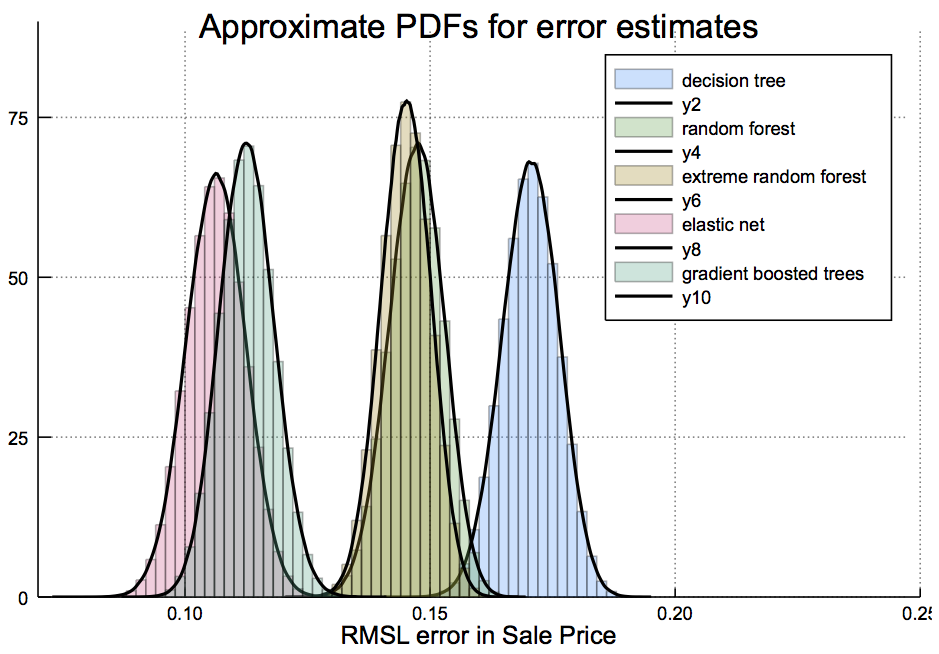

##&#128679; Site under construction

# Predicting House Prices in Ames, Iowa

*A series of Jupyter notebooks describing the steps taken to build an
 advanced Machine Learning model to predict house prices in Ames,
 Iowa.*

Consult the notebooks below  to:

- Get a sneak preview of a Julia package under
  development by the author that extends the well-known [ScikitLearn](http://scikit-learn.org/stable/) application
  programming interface (API) for Machine Learning (source not
  currently public)

- See how some common regression models (Random Forest, XGBoost,
  Elastic Net, etc) can be trained, tuned, and compared on a real data set
  (this process being generic and not dependent on a partiular
  programming language or API)

The data for this analysis was sourced from [Kaggle](https://www.kaggle.com/c/house-prices-advanced-regression-techniques).

- [Cleaning the Data](http://nbviewer.jupyter.org/github/ablaom/AmesHousePrices/blob/master/clean.ipynb)
- [Extracting important features](http://nbviewer.jupyter.org/github/ablaom/AmesHousePrices/blob/master/reduce.ipynb)
- [Building a random forest model](http://nbviewer.jupyter.org/github/ablaom/AmesHousePrices/blob/master/model_random_forest.ipynb)
- [Building an extreme random forest model](http://nbviewer.jupyter.org/github/ablaom/AmesHousePrices/blob/master/model_extreme_forest.ipynb)
- [Building an elastic net model (a ridge-lasso hybrid)](http://nbviewer.jupyter.org/github/ablaom/AmesHousePrices/blob/master/model_elastic_net.ipynb)
- [Building a gradient boosted tree (XGBoost) model](http://nbviewer.jupyter.org/github/ablaom/AmesHousePrices/blob/master/model_xgboost.ipynb)
- [Comparing the models](http://nbviewer.jupyter.org/github/ablaom/AmesHousePrices/blob/master/compare.ipynb)

> &copy; 2017 Anthony Blaom
